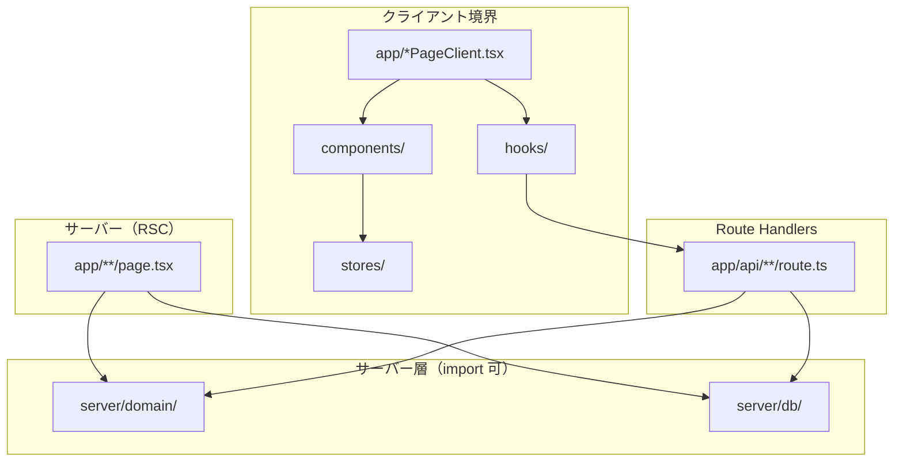
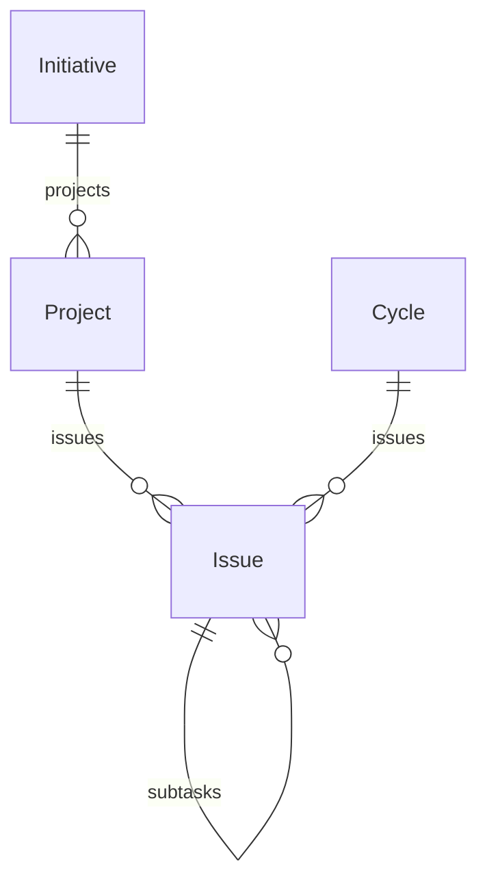
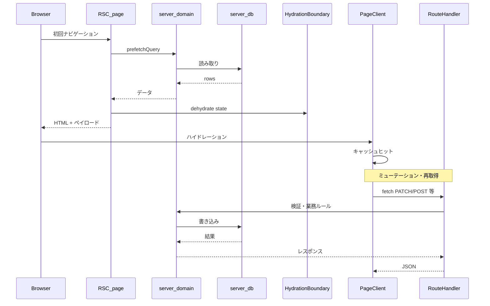

# Taskflow (laskflow)

A minimal, local-first task manager for solo developers. Inspired by Linear, powered by Claude.

## Tech Stack

- **Framework:** Next.js 16 (App Router, RSC + HydrationBoundary)
- **UI:** React 19, Tailwind CSS (light theme, teal accent)
- **Database:** Prisma 7 + SQLite
- **State:** TanStack Query v5 (server state), Zustand (UI state)
- **Testing:** Vitest (unit), Playwright (E2E)

## Features

### Issue Management

- **CRUD** -- Issue の作成・編集・削除。Project に紐付き、`{prefix}-{counter}` 形式の identifier を自動採番
- **Status workflow** -- backlog / todo / in_progress / in_review / done / cancelled の 6 状態。一覧でワンクリック遷移
- **Priority** -- urgent / high / medium / low / none の 5 段階
- **Detail slideover** -- Issue 行クリックで右側パネルを展開。URL に `?selected=<id>` を反映し、リロードで復元
- **Inline title edit** -- スライドオーバー内でタイトルを直接編集（blur で保存）
- **Description editor** -- MDXEditor による Markdown 編集（`next/dynamic` で SSR 無効の遅延読込）
- **Subtasks** -- 親 Issue に子タスクを追加。チェックボックスで done/todo を切り替え。一覧では `done/total` バッジを表示
- **Meta sidebar** -- Status, Priority, Project, Cycle, Due, Created をインライン編集
- **Drag & drop reordering** -- @dnd-kit による同一ステータス内の並び替え。楽観的更新 + fractional-indexing でサーバー永続化
- **Filter & sort bar** -- Status, Project, Cycle, Initiative, Sort の各フィルタ。URL 検索パラメータで状態管理しリロード後も維持

### Command Palette

- **Cmd+K / Ctrl+K** でグローバル検索パレットを表示
- Issue, Project, Initiative, Cycle を横断検索
- 選択で該当ページ/スライドオーバーへ遷移
- "Create new issue" アクション

### Project Management

- **Initiative** -- 上位の戦略目標。Initiative > Project > Issue の階層
- **Project** -- Issue のグループ単位。prefix による識別子管理、issueCounter で自動採番
- **Cycle** -- 期間ベースのスプリント。startDate / endDate で期間定義

### Detail Pages

- **Initiative detail** (`/initiatives/[id]`) -- タイトル・説明・ステータス・日付を表示
- **Project detail** (`/projects/[id]`) -- 所属 Issue 一覧 + スライドオーバー連携
- **Cycle detail** (`/cycles/[id]`) -- 進捗バー（完了率 vs 経過日数で色分け: 緑/黄/赤）+ Issue 一覧

### List Pages

- **Issues** (`/issues`) -- ステータスごとにグループ化した Issue 一覧。フィルタ・D&D 対応
- **Initiatives** (`/initiatives`) -- Initiative 一覧。インライン作成
- **Projects** (`/projects`) -- Project 一覧。インライン作成
- **Cycles** (`/cycles`) -- Cycle 一覧。インライン作成

### API

| Method | Endpoint | Description |
|--------|----------|-------------|
| GET | `/api/issues` | Issue 一覧（filter: status, priority, projectId, cycleId, initiativeId, sort） |
| POST | `/api/issues` | Issue 作成 |
| GET | `/api/issues/[id]` | Issue 詳細（children include） |
| PATCH | `/api/issues/[id]` | Issue 更新 |
| DELETE | `/api/issues/[id]` | Issue 削除 |
| POST | `/api/issues/[id]/move` | Issue 並び替え（beforeId / afterId） |
| GET | `/api/projects` | Project 一覧 |
| POST | `/api/projects` | Project 作成 |
| GET | `/api/projects/[id]` | Project 詳細 |
| PATCH | `/api/projects/[id]` | Project 更新 |
| DELETE | `/api/projects/[id]` | Project 削除 |
| GET | `/api/initiatives` | Initiative 一覧 |
| POST | `/api/initiatives` | Initiative 作成 |
| GET | `/api/initiatives/[id]` | Initiative 詳細 |
| PATCH | `/api/initiatives/[id]` | Initiative 更新 |
| DELETE | `/api/initiatives/[id]` | Initiative 削除 |
| GET | `/api/cycles` | Cycle 一覧 |
| POST | `/api/cycles` | Cycle 作成 |
| GET | `/api/cycles/[id]` | Cycle 詳細 |
| PATCH | `/api/cycles/[id]` | Cycle 更新 |
| DELETE | `/api/cycles/[id]` | Cycle 削除 |
| GET | `/api/search?q=` | 横断検索（issues, projects, initiatives, cycles） |

### Architecture（要約）

- **サーバー層:** `src/server/db/`（Prisma）+ `src/server/domain/`（Zod と業務ロジック）
- **クライアント境界:** ESLint でクライアント向けディレクトリから `@/server/**` の import を禁止
- **データ取得:** RSC で `prefetchQuery` → `HydrationBoundary` → クライアントで `useQuery`
- ディレクトリの対応関係やデータの流れは下記 [リポジトリ構成とアーキテクチャ](#リポジトリ構成とアーキテクチャ) を参照

## リポジトリ構成とアーキテクチャ

この節では、リポジトリ直下から `src/` までの役割と、Next.js App Router 上でのレイヤ分離・データの流れをまとめる。

### リポジトリ直下

| パス | 役割 |
|------|------|
| `src/` | アプリケーション本体（App Router、API、UI、サーバー層） |
| `prisma/` | `schema.prisma` とマイグレーション |
| `prisma.config.ts` | Prisma 7 の設定（データソース等） |
| `e2e/` | Playwright の設定・シード・スペック |
| `scripts/` | 運用スクリプト（例: `migrate-sort-order.ts`） |
| `docs/` | ADR、シナリオ、設計メモ |
| `data/` | SQLite ファイルの置き場（`.gitkeep`、ローカル DB） |
| `public/` | 静的アセット |

### `src/` のディレクトリ

```text
src/
├── app/                    # App Router: ページ・レイアウト・Route Handlers
│   ├── api/                # REST 風 API（issues / projects / initiatives / cycles / search）
│   ├── issues|projects|initiatives|cycles/
│   │   ├── page.tsx        # RSC: prefetch + HydrationBoundary
│   │   └── *PageClient.tsx # クライアントページ
│   └── layout.tsx          # QueryProvider, Sidebar, CommandPalette
├── components/             # UI（layout / issues / …）。サーバー層に依存しない
├── hooks/                  # TanStack Query などのデータフック
├── lib/                    # query-client, query-keys, schemas, fractional-index 等
├── server/
│   ├── db/                 # Prisma を叩く CRUD・クエリ
│   └── domain/             # Zod 検証とドメインロジック（API / RSC から利用）
├── stores/                 # Zustand 等の UI 状態
└── types/                  # 共有型
```

レイヤの依存方向のイメージは次のとおり（下位は上位に依存しない）。



### ドメインモデル（データ）

Prisma スキーマに対応するエンティティ関係。



- **Initiative → Project → Issue** の階層と、Issue の任意の **Cycle** 割り当て、**親子 Issue**（サブタスク）を表す。

### リクエストとデータ取得の流れ

一覧ページは RSC でサーバー上の `listIssues` 等を `prefetchQuery` し、脱水状態を `HydrationBoundary` で渡す。クライアントでは同じ `queryKey` で `useQuery` し、以降の更新は `/api/*` 経由で `server/domain` → `server/db` と流れる。



### API とサーバー層

- **Route Handlers**（`src/app/api/**/route.ts`）は HTTP の入り口。入力のパース・Zod 検証・ステータスコードはここまたは `server/domain` に寄せる。
- **`server/db/*`** は Prisma に閉じた読み書き。複雑な条件やトランザクションはここに集約しやすい。
- **`server/domain/*`** はアプリの「用語」に沿った操作（一覧フィルタ、並び替えキー計算、identifier 採番など）。RSC の prefetch も API も、原則として domain 経由で DB に触る。

クライアント専用コード（`components/**`, `hooks/**`, `stores/**`）から `server/**` を直接 import しないよう ESLint で縛り、バンドル漏洩と責務の混線を防ぐ。

### Issue の並び順

同一ステータス内の D&D 並び替えは **fractional indexing**（`sortOrder` 文字列）で表現し、`POST /api/issues/[id]/move` で前後キーから新しい `sortOrder` を計算して永続化する（詳細は `src/lib/fractional-index.ts` と ADR `docs/adr/0006-fractional-indexing-for-sort-order.md`）。

## Setup

```bash
pnpm install
pnpm exec prisma migrate deploy
pnpm migrate:sort-order   # 既存 Issue の sortOrder を採番
pnpm dev
```

## Testing

Complete [Setup](#setup) first so `data/taskflow.db` exists and migrations are applied.

### Unit tests (Vitest)

```bash
pnpm test
```

Watch mode: `pnpm test:watch`

### E2E tests (Playwright)

Install browser binaries once:

```bash
pnpm exec playwright install
```

E2E runs `e2e/global-setup.ts` to seed the database, then starts the app via `webServer` in `e2e/playwright.config.ts` and runs `e2e/*.spec.ts`.

```bash
pnpm test:e2e
```

When not in CI, Playwright reuses an existing dev server on port 3000 if one is already running.

Debug with UI mode:

```bash
pnpm exec playwright test --config=e2e/playwright.config.ts --ui
```

## Scripts

| Command | Description |
|---------|-------------|
| `pnpm dev` | 開発サーバー起動 |
| `pnpm build` | プロダクションビルド |
| `pnpm test` | Vitest ユニットテスト |
| `pnpm test:e2e` | Playwright E2E テスト |
| `pnpm lint` | ESLint |
